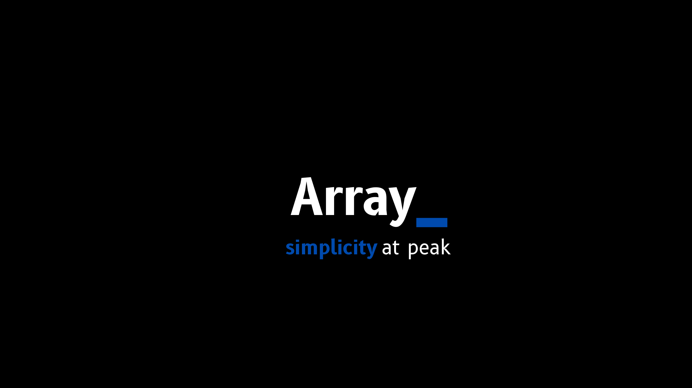
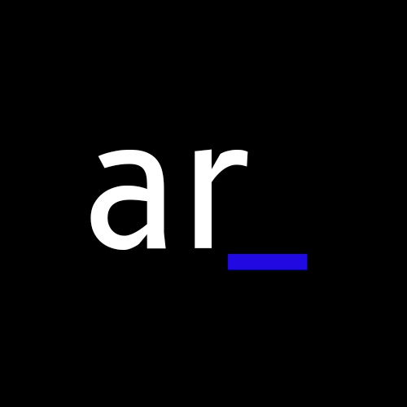

## Banner

## Logo

---
# Array - Learn to Code with Us!

Welcome to Array, your go-to destination for high-quality programming courses! 🚀

## About Us

Array is a platform dedicated to empowering individuals through coding education. We believe in making programming accessible to everyone, and our courses are designed to cater to both beginners and experienced developers.

## Connect with Us

- **Instagram:** [@arrayyyy](https://www.instagram.com/arrayreels)
- **YouTube:** [Array on YouTube](https://www.youtube.com/@arrayyyy)

Follow us on Instagram for bite-sized coding tips and tricks through engaging reels, and subscribe to our YouTube channel for short, insightful programming lessons!

## Join Our Coding Community

Are you passionate about coding and eager to learn? Join our vibrant community of learners on Instagram and YouTube. We share valuable content that will sharpen your coding skills and keep you updated with the latest trends in the tech world.

## Explore Our Courses
{Currently Courses are not available}
Dive into the world of coding with Array's comprehensive courses. Whether you're a beginner or looking to advance your skills, we have something for everyone. Check out our courses [here](#) and start your coding journey today.

## Stay Updated

Stay in the loop with our latest content, announcements, and course releases. Don't forget to star ⭐️ this repository to receive notifications and updates.

## Connect with Us

- **Instagram:** [@arrayyyy](https://www.instagram.com/arrayreels)
- **YouTube:** [Array on YouTube](https://www.youtube.com/@arrayyyy)

**Happy coding! 🚀**
